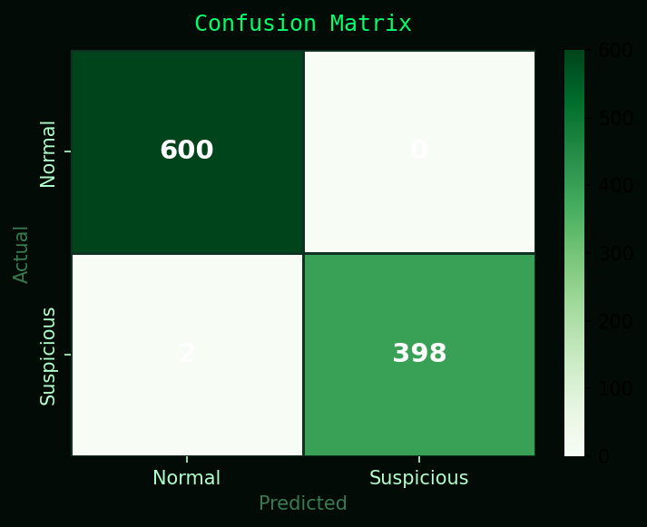
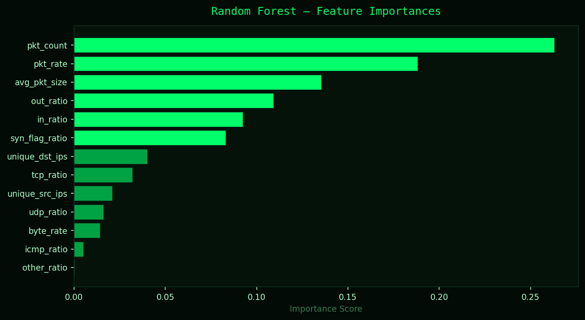
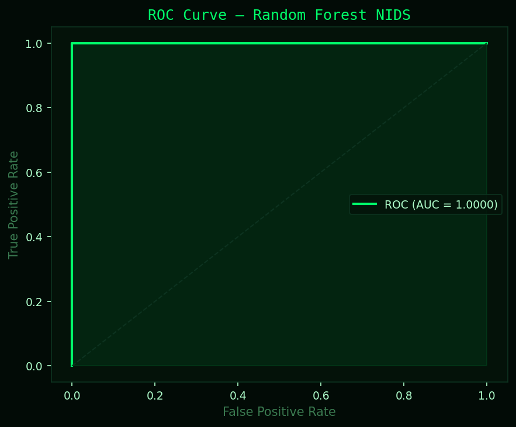

# NIDS-using-Random-forest

# 🛡️ NIDS SENTINEL — Network Intrusion Detection System

<div align="center">


**A real-time Network Intrusion Detection System powered by Machine Learning**  
*Live packet capture → Feature extraction → Random Forest classification → SOC-style dashboard*

</div>

---

## 📸 Dashboard Preview

> Dark-themed SOC-style dashboard with live charts, threat gauge, activity feed, and real-time alerts.



---

## 🚀 Features

- **Real-time packet capture** using Scapy on your network interface
- **Machine Learning backend** — Random Forest with 99.80% accuracy
- **Hybrid detection** — ML model + rule-based engine combined
- **SOC-style dashboard** — live charts, threat gauge, activity feed
- **Attack simulator** — inject 7 types of attacks for demo/testing
- **Windows compatible** — works with Npcap

---

## 🏗️ System Architecture

```
Your Network Interface (Wi-Fi / Ethernet)
           │
           ▼
    Scapy sniff()          ← captures every IP packet
           │
           ▼
    Packet Buffer          ← collects packets for 5 seconds
           │
           ▼
  Feature Extraction       ← 13 statistical features computed
           │
    ┌──────┴──────┐
    │             │
Random Forest   Rule Engine    ← hybrid detection
    │             │
    └──────┬──────┘
           │
      Final Verdict          ← Normal / Suspicious
           │
      Flask API              ← /api/window endpoint
           │
      Dashboard              ← polls every 5 seconds
```

---

## 🔬 13 Features Extracted Per Window

| Feature | Description |
|---|---|
| `pkt_count` | Total packets in 5s window |
| `avg_pkt_size` | Mean packet size in bytes |
| `tcp_ratio` | Fraction of TCP packets |
| `udp_ratio` | Fraction of UDP packets |
| `icmp_ratio` | Fraction of ICMP packets |
| `other_ratio` | Fraction of other protocols |
| `unique_src_ips` | Number of unique source IPs |
| `unique_dst_ips` | Number of unique destination IPs |
| `in_ratio` | Fraction of incoming traffic |
| `out_ratio` | Fraction of outgoing traffic |
| `syn_flag_ratio` | Fraction of TCP SYN packets |
| `pkt_rate` | Packets per second |
| `byte_rate` | Bytes per second |

---

## 🤖 ML Model Performance

| Metric | Score |
|---|---|
| **Accuracy** | 99.80% |
| **Precision** | 100.00% |
| **Recall** | 99.50% |
| **F1 Score** | 99.75% |
| **ROC-AUC** | 100.00% |
| **5-Fold CV F1** | 99.85% ± 0.09% |

### Confusion Matrix


### Feature Importance


### ROC Curve


---

## 🚨 Attack Types Detected

| Attack | Detection Method | Key Feature |
|---|---|---|
| **DDoS** | ML + Rule | `pkt_count > 1000`, `unique_src_ips > 150` |
| **Port Scan** | ML | High `syn_flag_ratio`, many `unique_dst_ips` |
| **SYN Flood** | ML + Rule | `syn_flag_ratio > 0.40` |
| **UDP Flood** | ML + Rule | `udp_ratio > 0.60` |
| **ICMP Flood** | ML + Rule | `icmp_ratio > 0.30` |
| **Brute Force** | ML | High TCP, same destination |
| **Data Exfiltration** | Rule | `out_ratio > 0.80` + large packets |

---

## 📁 Project Structure

```
nids-sentinel/
│
├── 1_generate_dataset.py       # Generate 5000 labeled training samples
├── 2_train_model.py            # Train Random Forest + save model
├── 5_attack_simulator.py       # Inject attack traffic for demo
├── 6_flask_server.py           # Main server — capture + ML + API
├── nids_dashboard_live.html    # SOC dashboard — polls Flask every 5s
│
├── reports/
│   ├── confusion_matrix.png
│   ├── feature_importance.png
│   └── roc_curve.png
│
├── requirements.txt
└── README.md
```

> **Note:** `models/` and `data/` folders are auto-generated when you run the setup steps. They are not included in the repo.

---

## ⚙️ Setup & Installation

### Prerequisites
- Python 3.10+
- Windows: [Npcap](https://npcap.com/#download) installed with **WinPcap API-compatible mode**
- Run terminal **as Administrator** (needed for raw packet capture)

### Step 1 — Clone the repo
```bash
git clone https://github.com/YOUR_USERNAME/nids-sentinel.git
cd nids-sentinel
```

### Step 2 — Install dependencies
```bash
pip install -r requirements.txt
```

### Step 3 — Generate dataset & train model
```bash
python 1_generate_dataset.py
python 2_train_model.py
```

Expected output:
```
Accuracy  : 99.80%
F1 Score  : 99.75%
ROC-AUC   : 100.00%
✓ Model saved → models/rf_nids_model.pkl
```

### Step 4 — Start the Flask server
```bash
# Windows — run as Administrator
python 6_flask_server.py
```

### Step 5 — Open the dashboard
```
http://localhost:5000
```

### Step 6 — Run attack simulator (for demo)
```bash
# Second terminal
python 5_attack_simulator.py
# Select option 8 for full demo sequence
```

---

## 🎬 Demo

1. Start `6_flask_server.py` as Administrator
2. Open `http://localhost:5000` in browser
3. Run `5_attack_simulator.py` → option 8
4. Watch the dashboard detect attacks in real time

**Attack sequence includes:**
- HTTP Flood → `HIGH_PKT_RATE`
- UDP Flood → `UDP_FLOOD`
- TCP Connection Flood → `SYN_FLOOD`
- Port Scan → ML detection
- Brute Force → ML detection
- Data Exfiltration → `EXFILTRATION`
- ICMP Flood → `ICMP_FLOOD`

---

## 🔧 Configuration

In `6_flask_server.py` you can adjust:

```python
WINDOW_SECONDS = 5     # classification interval
CAPTURE_IFACE  = r"\Device\NPF_{...}"  # your network interface
```

To find your interface run:
```bash
python -c "from scapy.all import get_if_list; print(get_if_list())"
```

---

## 🧠 Why Random Forest?

- Works perfectly on tabular/statistical data
- Resistant to overfitting (100 trees = robust ensemble)
- Gives feature importance rankings
- Fast inference — classifies one window in microseconds
- Handles class imbalance with `class_weight="balanced"`
- No assumptions about data distribution

---

## ⚠️ Disclaimer

This project is for **educational purposes only**.  
The attack simulator targets your own machine (`localhost`) and is safe for demo use.  
Do not use this on networks you do not own or have permission to monitor.

---

## 👨‍💻 Author

**Aryan Singh**  
Cybersecurity Portfolio Project  
Built with Python, Scapy, scikit-learn, Flask

---

## 📄 License

MIT License — free to use, modify, and distribute.
